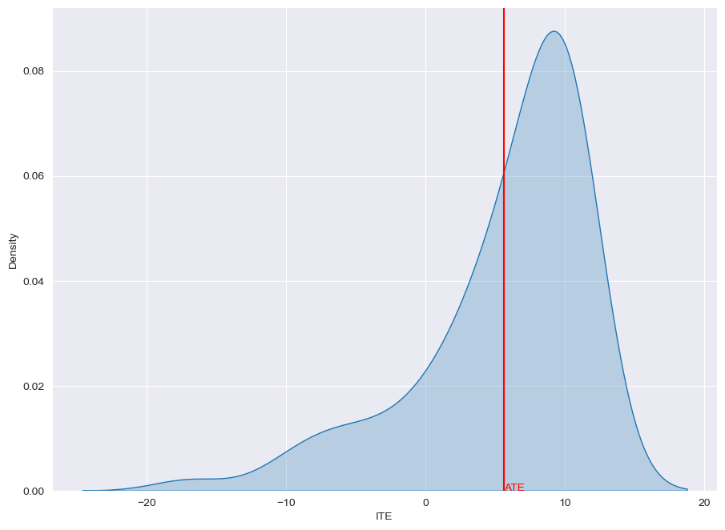
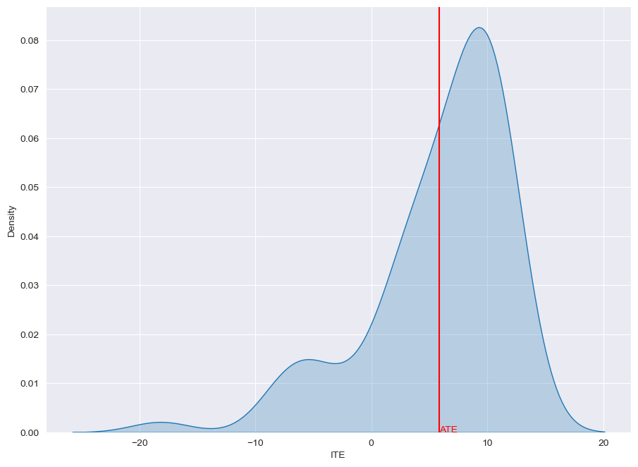

DragonNet
=========

**Reference**: `Claudia Shi et al, Adapting Neural Networks for the
Estimation of Treatment Effects, NeurIPS
2019 <https://arxiv.org/pdf/1906.02120v2.pdf>`__

**Implementation remarks**: our implementation is exactly the same of
the original paper with the exception of a
``sklearn.preprocessing.StandardScaler`` which was originally used to
scale predictions.

DragonNet on IHDP
-----------------

.. code:: python

    from causalforge.model import Model , PROBLEM_TYPE
    from causalforge.data_loader import DataLoader 
    
    # load IHDP dataset 
    r = DataLoader.get_loader('IHDP').load()
    X_tr, T_tr, YF_tr, YCF_tr, mu_0_tr, mu_1_tr, X_te, T_te, YF_te, YCF_te, mu_0_te, mu_1_te = r
    
    # model 
    params={}
    params['input_dim'] = X_tr.shape[1] 
        
        
    dragonnet = Model.create_model("dragonnet",
                                   params,
                                   problem_type=PROBLEM_TYPE.CAUSAL_TREATMENT_EFFECT_ESTIMATION, 
                                   multiple_treatments=False)
    
    dragonnet.model.summary()

.. parsed-literal::

    2023-05-08 11:27:39.405731: I tensorflow/core/platform/cpu_feature_guard.cc:193] This TensorFlow binary is optimized with oneAPI Deep Neural Network Library (oneDNN) to use the following CPU instructions in performance-critical operations:  SSE4.1 SSE4.2 AVX AVX2 FMA
    To enable them in other operations, rebuild TensorFlow with the appropriate compiler flags.

.. parsed-literal::

    Model: "model"
    __________________________________________________________________________________________________
     Layer (type)                   Output Shape         Param #     Connected to                     
    ==================================================================================================
     input (InputLayer)             [(None, 25)]         0           []                               
                                                                                                      
     dense (Dense)                  (None, 200)          5200        ['input[0][0]']                  
                                                                                                      
     dense_1 (Dense)                (None, 200)          40200       ['dense[0][0]']                  
                                                                                                      
     dense_2 (Dense)                (None, 200)          40200       ['dense_1[0][0]']                
                                                                                                      
     dense_4 (Dense)                (None, 100)          20100       ['dense_2[0][0]']                
                                                                                                      
     dense_5 (Dense)                (None, 100)          20100       ['dense_2[0][0]']                
                                                                                                      
     dense_6 (Dense)                (None, 100)          10100       ['dense_4[0][0]']                
                                                                                                      
     dense_7 (Dense)                (None, 100)          10100       ['dense_5[0][0]']                
                                                                                                      
     dense_3 (Dense)                (None, 1)            201         ['dense_2[0][0]']                
                                                                                                      
     y0_predictions (Dense)         (None, 1)            101         ['dense_6[0][0]']                
                                                                                                      
     y1_predictions (Dense)         (None, 1)            101         ['dense_7[0][0]']                
                                                                                                      
     epsilon_layer (EpsilonLayer)   (None, 1)            1           ['dense_3[0][0]']                

     concatenate (Concatenate)      (None, 4)            0           ['y0_predictions[0][0]',         
                                                                      'y1_predictions[0][0]',         
                                                                      'dense_3[0][0]',                
                                                                      'epsilon_layer[0][0]']          
                                                                                                      
    ==================================================================================================
    Total params: 146,404
    Trainable params: 146,404
    Non-trainable params: 0
    __________________________________________________________________________________________________

Parameters
----------

-  **input_dim**: number of inputs
-  **neurons_per_layer**: number of neurons per layer (by default,
   ``200``)
-  **reg_l2**: L2 regularization (by default, ``0.01``)
-  **targeted_reg**: to use the targeted regularization term (by default, ``True``)
-  **verbose**: verbose (by default, ``True``)
-  **val_split**: validation split ratio (by default, ``0.22``)
-  **batch_size**: batch size (by default, ``64``)
-  **ratio**: relative importance of the targeted regularization term,
   if adopted (by default, ``1.0``)
-  **epochs**: number of epochs (by default, ``500``)
-  **learning_rate**: learning rate (by default, ``1e-5``)
-  **momentum**: momentum (by default, ``0.9``)
-  **use_adam**: to use Adam before SGD (by default, ``True``)
-  **adam_epochs**: number of epochs to use for Adam, if adopted (by default, ``30``)
-  **adam_learning_rate**: learning rate for Adam, if adopted (by default, ``1e-3``)

Training
--------

.. code:: python

    from causalforge.metrics import eps_ATE_diff, PEHE_with_ite
    import numpy as np
    
    experiment_ids = [1,10,400]
    
    eps_ATE_tr, eps_ATE_te = [], []
    eps_PEHE_tr, eps_PEHE_te = [] , [] 
    
    
    
    for idx in experiment_ids:    
        t_tr, y_tr, x_tr, mu0tr, mu1tr = T_tr[:,idx] , YF_tr[:,idx], X_tr[:,:,idx], mu_0_tr[:,idx], mu_1_tr[:,idx] 
        t_te, y_te, x_te, mu0te, mu1te = T_te[:,idx] , YF_te[:,idx], X_te[:,:,idx], mu_0_te[:,idx], mu_1_te[:,idx]  
        
        
        # Train your causal method on train-set ...
        dragonnet.fit(x_tr,t_tr,y_tr)
    
        # Validate your method test-set ... 
        ATE_truth_tr = (mu1tr - mu0tr).mean()
        ATE_truth_te = (mu1te - mu0te).mean()
        
        ITE_truth_tr = (mu1tr - mu0tr)
        ITE_truth_te = (mu1te - mu0te)
        
        eps_ATE_tr.append( eps_ATE_diff( dragonnet.predict_ate(x_tr,t_tr,y_tr), ATE_truth_tr) )
        eps_ATE_te.append( eps_ATE_diff( dragonnet.predict_ate(x_te,t_te,y_te), ATE_truth_te) )
        
        eps_PEHE_tr.append( PEHE_with_ite( dragonnet.predict_ite(x_tr), ITE_truth_tr, sqrt=True))
        eps_PEHE_te.append( PEHE_with_ite( dragonnet.predict_ite(x_te), ITE_truth_te , sqrt=True))
            

.. parsed-literal::

    Epoch 1/30
    9/9 [==============================] - 2s 45ms/step - loss: 1933.4249 - regression_loss: 889.4026 - binary_classification_loss: 40.9478 - treatment_accuracy: 0.5728 - track_epsilon: 0.0388 - val_loss: 867.6917 - val_regression_loss: 296.2574 - val_binary_classification_loss: 29.3260 - val_treatment_accuracy: 0.8006 - val_track_epsilon: 0.0409 - lr: 0.0010
    Epoch 2/30
    9/9 [==============================] - 0s 6ms/step - loss: 475.6049 - regression_loss: 207.7449 - binary_classification_loss: 35.2396 - treatment_accuracy: 0.8106 - track_epsilon: 0.0398 - val_loss: 456.4780 - val_regression_loss: 154.8738 - val_binary_classification_loss: 22.1945 - val_treatment_accuracy: 0.8006 - val_track_epsilon: 0.0395 - lr: 0.0010
    ...
    9/9 [==============================] - 0s 6ms/step - loss: 146.2634 - regression_loss: 54.4143 - binary_classification_loss: 26.8517 - treatment_accuracy: 0.7856 - track_epsilon: 0.0155 - val_loss: 208.7841 - val_regression_loss: 104.0300 - val_binary_classification_loss: 17.8242 - val_treatment_accuracy: 0.9115 - val_track_epsilon: 0.0155 - lr: 1.5625e-07
    Epoch 91/100
    9/9 [==============================] - 0s 6ms/step - loss: 147.0557 - regression_loss: 54.3474 - binary_classification_loss: 26.8511 - treatment_accuracy: 0.8019 - track_epsilon: 0.0154 - val_loss: 208.5912 - val_regression_loss: 103.8927 - val_binary_classification_loss: 17.8261 - val_treatment_accuracy: 0.9115 - val_track_epsilon: 0.0154 - lr: 1.5625e-07
    21/21 [==============================] - 0s 1ms/step
    3/3 [==============================] - 0s 2ms/step
    21/21 [==============================] - 0s 1ms/step
    3/3 [==============================] - 0s 2ms/step

Results
-------

.. code:: python

    import pandas as pd 
    
    pd.DataFrame([[np.mean(eps_ATE_tr),np.mean(eps_ATE_te),np.mean(eps_PEHE_tr),np.mean(eps_PEHE_te)]],
                 columns=['eps_ATE_tr','eps_ATE_te','eps_PEHE_tr','eps_PEHE_te'], 
                 index=['DragonNet'])

.. raw:: html

    

    
    <table border="1" class="dataframe">
      <thead>
        <tr style="text-align: right;">
          <th></th>
          <th>eps_ATE_tr</th>
          <th>eps_ATE_te</th>
          <th>eps_PEHE_tr</th>
          <th>eps_PEHE_te</th>
        </tr>
      </thead>
      <tbody>
        <tr>
          <th>DragonNet</th>
          <td>0.083165</td>
          <td>0.096781</td>
          <td>0.668761</td>
          <td>0.630287</td>
        </tr>
      </tbody>
    </table>
    

ITE distribution: learned vs. ground truth
------------------------------------------

Learned
~~~~~~~

.. code:: python

    from causalforge.utils import plot_ite_distribution
    
    plot_ite_distribution(dragonnet.predict_ite(x_te))

Ground Truth
~~~~~~~~~~~~

.. code:: python

    from causalforge.utils import plot_ite_distribution
    
    plot_ite_distribution(ITE_truth_te)

