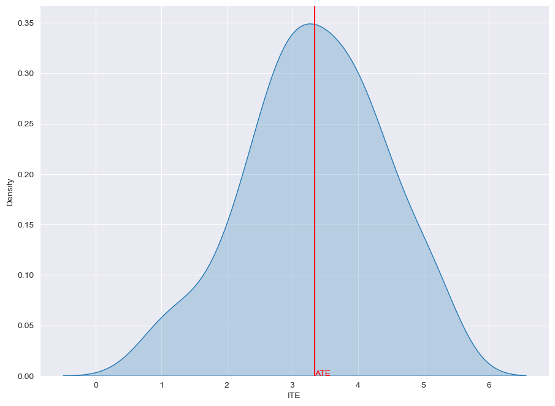

GANITE
======

**Reference**: `Jinsung Yoon, James Jordon, Mihaela van der Schaar,
GANITE: Estimation of Individualized Treatment Effects using Generative
Adversarial Nets, ICLR 2018 <https://openreview.net/pdf?id=ByKWUeWA->`__

**Implementation remarks**: our implementation is exactly the same of
the original paper.

GANITE on IHDP
--------------

.. code:: python

    from causalforge.model import Model , PROBLEM_TYPE
    from causalforge.data_loader import DataLoader 
    
    # load IHDP dataset 
    r = DataLoader.get_loader('IHDP').load()
    X_tr, T_tr, YF_tr, YCF_tr, mu_0_tr, mu_1_tr, X_te, T_te, YF_te, YCF_te, mu_0_te, mu_1_te = r
    
    # model 
    params={}
    params['dim_hidden'] = 100 
    params['minibatch_size'] = 256 
    params['alpha'] = 0.1
    params['beta'] = 0
    params['num_iterations'] = 500 
    params['num_discr_iterations'] = 1
        
        
    ganite = Model.create_model("ganite",
                                params,
                                problem_type=PROBLEM_TYPE.CAUSAL_TREATMENT_EFFECT_ESTIMATION, 
                                multiple_treatments=False)

Parameters
----------

-  **dim_hidden**: hidden dimension (by default, ``100``)
-  **minibatch_size**: batch-size (by default, ``256``)
-  **reg_l2**: L2 regularization (by default, ``0.01``)
-  **alpha**: alpha (by default, ``0.1``)
-  **beta**: beta (by default, ``0``)
-  **depth**: depth (by default, ``0``)
-  **num_iterations**: number of iterations (by default, ``5000``)
-  **num_discr_iterations**: number of iterations of discriminator (by default, ``1``)

Training
--------

.. code:: python

    from causalforge.metrics import eps_ATE_diff, PEHE_with_ite
    import numpy as np
    
    experiment_ids = [1,10,400]
    
    eps_ATE_tr, eps_ATE_te = [], []
    eps_PEHE_tr, eps_PEHE_te = [] , [] 
    
    
    
    for idx in experiment_ids:    
        t_tr, y_tr, x_tr, mu0tr, mu1tr = T_tr[:,idx] , YF_tr[:,idx], X_tr[:,:,idx], mu_0_tr[:,idx], mu_1_tr[:,idx] 
        t_te, y_te, x_te, mu0te, mu1te = T_te[:,idx] , YF_te[:,idx], X_te[:,:,idx], mu_0_te[:,idx], mu_1_te[:,idx]  
        
        
        # Train your causal method on train-set ...
        ganite.fit(x_tr,t_tr,y_tr)
    
        # Validate your method test-set ... 
        ATE_truth_tr = (mu1tr - mu0tr).mean()
        ATE_truth_te = (mu1te - mu0te).mean()
        
        ITE_truth_tr = (mu1tr - mu0tr)
        ITE_truth_te = (mu1te - mu0te)
        
        eps_ATE_tr.append( eps_ATE_diff( ganite.predict_ate(x_tr,t_tr,y_tr), ATE_truth_tr) )
        eps_ATE_te.append( eps_ATE_diff( ganite.predict_ate(x_te,t_te,y_te), ATE_truth_te) )
        
        eps_PEHE_tr.append( PEHE_with_ite( ganite.predict_ite(x_tr), ITE_truth_tr, sqrt=True))
        eps_PEHE_te.append( PEHE_with_ite( ganite.predict_ite(x_te), ITE_truth_te , sqrt=True))
            

.. parsed-literal::

    Generator loss epoch 0: 0.6381762623786926 30.862741470336914
    Generator loss epoch 100: 0.003728393232449889 16.405466079711914
    Generator loss epoch 200: 0.0014365405077114701 9.917235374450684
    Generator loss epoch 300: 0.0011493910569697618 6.902956008911133
    Generator loss epoch 400: 0.0013534935424104333 3.959357738494873
    Inference loss epoch 0: 21.016639709472656
    Inference loss epoch 100: 15.584854125976562
    Inference loss epoch 200: 9.773422241210938
    Inference loss epoch 300: 8.935896873474121
    Inference loss epoch 400: 7.52246618270874
    Generator loss epoch 0: 0.6245900392532349 40.30231857299805
    Generator loss epoch 100: 0.005318560171872377 22.773630142211914
    Generator loss epoch 200: 0.0017221181187778711 14.723432540893555
    Generator loss epoch 300: 0.001508277957327664 8.983695983886719
    Generator loss epoch 400: 0.0011473450576886535 5.9448418617248535
    Inference loss epoch 0: 23.86356544494629
    Inference loss epoch 100: 15.311829566955566
    Inference loss epoch 200: 13.44272518157959
    Inference loss epoch 300: 9.781745910644531
    Inference loss epoch 400: 7.9263916015625
    Generator loss epoch 0: 0.5558345913887024 159.0293426513672
    Generator loss epoch 100: 0.0016039644833654165 144.30055236816406
    Generator loss epoch 200: 0.0006120165344327688 93.21966552734375
    Generator loss epoch 300: 0.0006608975236304104 75.96114349365234
    Generator loss epoch 400: 0.0006516539724543691 39.48774719238281
    Inference loss epoch 0: 79.98333740234375
    Inference loss epoch 100: 68.76531982421875
    Inference loss epoch 200: 56.01595687866211
    Inference loss epoch 300: 56.58964157104492
    Inference loss epoch 400: 46.454689025878906

Results
-------

.. code:: python

    import pandas as pd 
    
    pd.DataFrame([[np.mean(eps_ATE_tr),np.mean(eps_ATE_te),np.mean(eps_PEHE_tr),np.mean(eps_PEHE_te)]],
                 columns=['eps_ATE_tr','eps_ATE_te','eps_PEHE_tr','eps_PEHE_te'], 
                 index=['DragonNet'])

.. raw:: html

    

    
    <table border="1" class="dataframe">
      <thead>
        <tr style="text-align: right;">
          <th></th>
          <th>eps_ATE_tr</th>
          <th>eps_ATE_te</th>
          <th>eps_PEHE_tr</th>
          <th>eps_PEHE_te</th>
        </tr>
      </thead>
      <tbody>
        <tr>
          <th>GANITE</th>
          <td>1.289279</td>
          <td>1.360971</td>
          <td>3.802482</td>
          <td>3.843936</td>
        </tr>
      </tbody>
    </table>
    

ITE distribution: learned vs. ground truth
------------------------------------------

Learned
~~~~~~~

.. code:: python

    from causalforge.utils import plot_ite_distribution
    
    plot_ite_distribution(ganite.predict_ite(x_te))

Ground Truth
~~~~~~~~~~~~

.. code:: python

    from causalforge.utils import plot_ite_distribution
    
    plot_ite_distribution(ITE_truth_te)

.. image:: ganite_output_12_1.png

