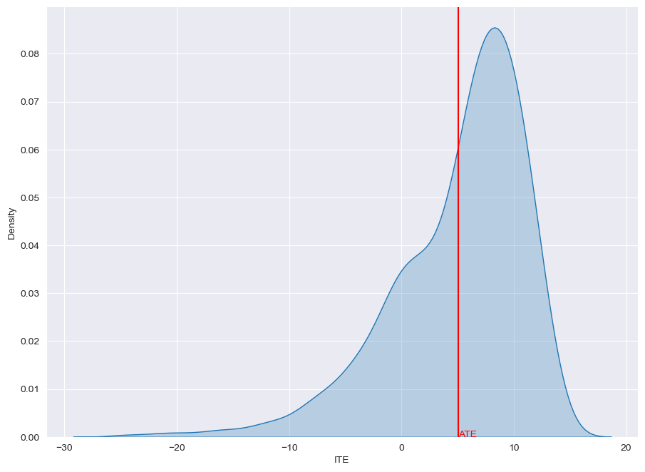

Loading Real-World & Benchmarking Datasets with CausalForge
===========================================================

A dataset used for causal studies is, in general, different from
datasets used for associational studies. In causal inference we have a
fundamental problem which is, indeed, referred as fundamental problem of
causal inference.

**Fundamental problem of causal inference (FPCI)**: *we do not observe
both potential outcomes (control & treated), but we only observe one.*

Indeed, this formulation of FPCI holds only for binary exposures, when
we have two cohorts: treated & control (or untreated). In case of T
exposures, we observe only one potential outcome and we do not observe
the remaining T-1. An unobserved potential outcome is generally referred
as **counterfactual**.

In causal inference we have

-  **real-world datasets**: these datasets are real datasets; they are
   typically observational and obey to the FPCI, hence, they don’t come
   with counterfactuals; as a conseguence, it should not be possible to
   do causal model validation on this kind of datsets, although there
   are people who adopt associational metrics (e.g. accuracy or auROC)
   pretending they are proxies of causal metrics like PEHE (Precision in
   Estimation of Heterogeneous Effect) or ATE (Average Treatment Effect, 
   which, on the contrary, require counterfactuals;

-  **benchmarking datasets**: these datasets can be either simulations
   or combinations of real-world datasets and Randomized Control Trials 
   (RCTs), and **they come with counterfactuals**; they can be used to 
   do causal model validation.

With CausalForge it is very easy to load a dataset. First, you want to
load a proper **data loader** given the name of the dataset, and then
you want to load all the typical ingredients of a causal inference
dataset, i.e., **covariates**, **teatment assigments**, **factuals**
and, if available, **counterfactuals**.

Let’s see this in action with a dataset very popular in the causal
inference community: **IHDP**.

The IHDP Dataset
----------------

The Infant Health and Development Program (IHDP) is a randomized
controlled study designed to evaluate the effect of home visit from
specialist doctors on the cognitive test scores of premature infants.
The datasets is first used for benchmarking treatment effect estimation
algorithms in Hill [1], where selection bias is induced by removing
non-random subsets of the treated individuals to create an observational
dataset, and the outcomes are generated using the original covariates
and treatments. It contains 747 subjects and 25 variables. In order to
compare our results with the literature and make our results
reproducible, we use the simulated outcome implemented as setting “A” in
[2], and downloaded the data at https://www.fredjo.com/, which is
composed of 1000 repetitions of the experiment.

.. code:: python

    from causalforge.data_loader import DataLoader 
    
    r = DataLoader.get_loader('IHDP').load()
    X_tr, T_tr, YF_tr, YCF_tr, mu_0_tr, mu_1_tr, X_te, T_te, YF_te, YCF_te, mu_0_te, mu_1_te = r 
    
    X_tr.shape, T_tr.shape, YF_tr.shape, YCF_tr.shape, mu_0_tr.shape , mu_1_tr.shape

.. parsed-literal::

    2023-05-04 21:55:10.169545: I tensorflow/core/platform/cpu_feature_guard.cc:193] This TensorFlow binary is optimized with oneAPI Deep Neural Network Library (oneDNN) to use the following CPU instructions in performance-critical operations:  SSE4.1 SSE4.2 AVX AVX2 FMA
    To enable them in other operations, rebuild TensorFlow with the appropriate compiler flags.

.. parsed-literal::

    ((672, 25, 1000),
     (672, 1000),
     (672, 1000),
     (672, 1000),
     (672, 1000),
     (672, 1000))

.. code:: python

    X_te.shape, T_te.shape, YF_te.shape , YCF_te.shape, mu_0_te.shape , mu_1_te.shape 

.. parsed-literal::

    ((75, 25, 1000), (75, 1000), (75, 1000), (75, 1000), (75, 1000), (75, 1000))

Specifically,

-  **for the trainset** X_tr, T_tr, YF_tr, YCF_tr, mu_0_tr, mu_1_tr are
   covariates, treatment, factual outcome, counterfactual outcome, and
   noiseless potential outcomes respectively;
-  **for the testset** X_te, T_te, YF_te, YCF_te, mu_0_te, mu_1_te are
   covariates, treatment, factual outcome, counterfactual outcome, and
   noiseless potential outcomes respectively;

Notice that the last dimension of each variable is 1000, as we have 1000
repetitions of the experiment. Hence, this dataset should be used pretty
much like in this code sketch:

.. code:: python

    for idx in range(X_tr.shape[-1]):    
        t_tr, y_tr, x_tr, mu0tr, mu1tr = T_tr[:,idx] , YF_tr[:,idx], X_tr[:,:,idx], mu_0_tr[:,idx], mu_1_tr[:,idx] 
        t_te, y_te, x_te, mu0te, mu1te = T_te[:,idx] , YF_te[:,idx], X_te[:,:,idx], mu_0_te[:,idx], mu_1_te[:,idx]  
    
        # Train your causal method on train-set ...
    
        # Validate your method test-set ... 
        ATE_truth_tr = (mu1tr - mu0tr).mean()
        ATE_truth_te = (mu1te - mu0te).mean()
        
        ITE_truth_tr = (mu1tr - mu0tr)
        ITE_truth_te = (mu1te - mu0te)
        
        if idx<10:
            print("++++ Experiment ",idx,"/",X_tr.shape[-1])
            print("  ATE (train/test)::", ATE_truth_tr, ATE_truth_te)
            print("  ITE (train/test)::", ITE_truth_tr.shape, ITE_truth_te.shape)

.. parsed-literal::

    ++++ Experiment  0 / 1000
      ATE (train/test):: 4.0144505901891705 4.0305489972436686
      ITE (train/test):: (672,) (75,)
    ++++ Experiment  1 / 1000
      ATE (train/test):: 4.061018726235442 3.9596262629599708
      ITE (train/test):: (672,) (75,)
    ++++ Experiment  2 / 1000
      ATE (train/test):: 4.110469801399948 3.9978605132504823
      ITE (train/test):: (672,) (75,)
    ++++ Experiment  3 / 1000
      ATE (train/test):: 4.254634722808619 4.4443103197221285
      ITE (train/test):: (672,) (75,)
    ++++ Experiment  4 / 1000
      ATE (train/test):: 4.151266973614955 4.262547405163926
      ITE (train/test):: (672,) (75,)
    ++++ Experiment  5 / 1000
      ATE (train/test):: 4.011426976855247 3.937131526610354
      ITE (train/test):: (672,) (75,)
    ++++ Experiment  6 / 1000
      ATE (train/test):: 3.9941264781108985 3.958499708600623
      ITE (train/test):: (672,) (75,)
    ++++ Experiment  7 / 1000
      ATE (train/test):: 3.869525188323851 3.7114417347352258
      ITE (train/test):: (672,) (75,)
    ++++ Experiment  8 / 1000
      ATE (train/test):: 10.202749856423566 12.825092953893234
      ITE (train/test):: (672,) (75,)
    ++++ Experiment  9 / 1000
      ATE (train/test):: 4.787728196307775 2.7785207988543785
      ITE (train/test):: (672,) (75,)

Whatever metric is adopted, at the end, results should be averaged over
the 1000 repetitions.

Notice that even if we use the ground truth on the train-set to estimate
the ATE of the test-set we don’t have a zero error:

.. code:: python

    from causalforge.metrics import eps_ATE
    import numpy as np
    
    eps_ATE(np.vstack([mu1tr,mu0tr]).transpose() , np.vstack([mu1te,mu0te]).transpose())

.. parsed-literal::

    0.5879717298086842

Plot ITE Distribution
---------------------

.. code:: python

    from causalforge.utils import plot_ite_distribution
    
    plot_ite_distribution(ITE_truth_tr)

.. parsed-literal::

    <seaborn.axisgrid.FacetGrid at 0x7f827415f160>

References
----------

1. `Hill J.L., Bayesian nonparametric modeling for causal inference, J.
   Comput. Graph. Statist., 20 (1) (2011), pp. 217-240,
   10.1198/jcgs.2010.08162 <https://www.tandfonline.com/doi/abs/10.1198/jcgs.2010.08162>`__

2. Shi C., Blei D.M., Veitch V., Adapting neural networks for the
   estimation of treatment effects Wallach H.M., Larochelle H.,
   Beygelzimer A., d’Alché Buc F., Fox E.B., Garnett R. (Eds.), NeurIPS
   (2019), pp. 2503-2513
